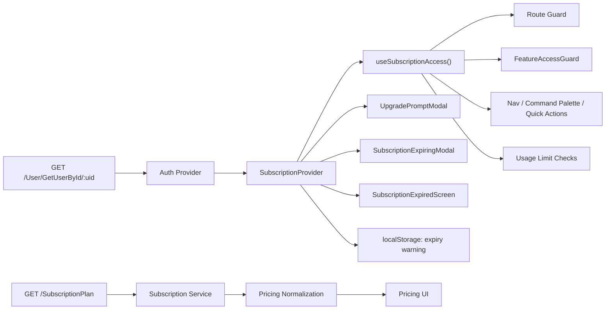
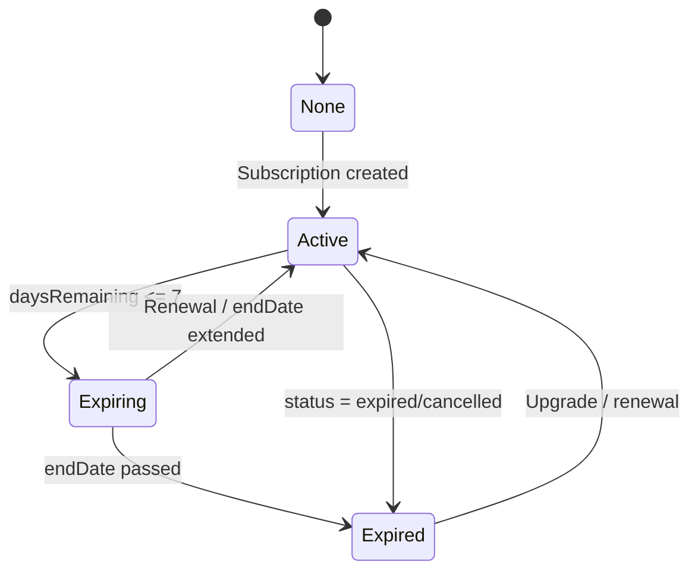

# Subscription Module — Implementation & Workflow

This document explains the full subscription implementation, workflow, and extension points. It is written for developers who will maintain or extend the module.

## Scope

- Centralized feature gating and usage limits.
- Route, navigation, and in-screen enforcement.
- Upgrade, expiring, and expired UX.
- Normalized plan catalog for pricing UI.

## End-to-End Workflow

1. Auth payload includes `user.subscription` from `GET /User/GetUserById/:uid`.
2. `SubscriptionProvider` normalizes features and limits with defaults.
3. `useSubscriptionAccess()` exposes access/limit helpers.
4. `SubscriptionRouteGuard` blocks or overlays routes.
5. In-screen feature locks and limit checks use the hook helpers.
6. Upgrade and expiring modals surface standardized UX.

## Data Model

### Source of truth

- API: `GET /User/GetUserById/:uid`
- Field: `user.subscription`

### Types and defaults

File: `src/types/subscription.ts`

Key types and defaults are centralized here.

```ts
export type SubscriptionFeatures = {
  memberManagement: boolean;
  attendanceTracking: boolean;
  liveAttendance: boolean;
  manualAttendance: boolean;
  paymentTracking: boolean;
  basicReports: boolean;
  // ...more features
  devicesPerUserLimit: number;
  staffLoginLimit: number;
  trainerLoginLimit: number;
};

export type UsageLimits = {
  maxMembers: number;
  maxTrainers: number;
  maxStaffs: number;
  maxClubs: number;
};

export const DEFAULT_SUBSCRIPTION_FEATURES: SubscriptionFeatures = {
  memberManagement: false,
  attendanceTracking: false,
  liveAttendance: false,
  manualAttendance: false,
  paymentTracking: false,
  basicReports: false,
  // ...
  devicesPerUserLimit: 0,
  staffLoginLimit: 0,
  trainerLoginLimit: 0,
};

export const DEFAULT_USAGE_LIMITS: UsageLimits = {
  maxMembers: 0,
  maxTrainers: 0,
  maxStaffs: 0,
  maxClubs: 0,
};
```

### Auth integration

- `src/services/auth/auth.ts` includes `subscription` in the user type.
- `src/providers/auth-provider.tsx` passes subscription into auth state.

## Core Architecture

### SubscriptionProvider

File: `src/providers/subscription-provider.tsx`

Responsibilities:

- Merge defaults with backend values.
- Derive `status`, `daysRemaining`, `endDateLabel`.
- Control upgrade modal and expiring modal.
- Persist expiring warning once per day per user.

Minimal usage in app root:

```tsx
import { SubscriptionProvider } from '@/providers/subscription-provider';

<SubscriptionProvider>{children}</SubscriptionProvider>;
```

### Access Hook

File: `src/hooks/use-subscription-access.ts`

Public API:

- `hasFeatureAccess(feature)`
- `requireFeatureAccess(feature, context?)`
- `isLimitExceeded(limitKey, currentCount)`
- `requireLimitAccess(limitKey, currentCount, context?)`

Feature check example:

```tsx
const { requireFeatureAccess } = useSubscriptionAccess();

const canOpen = requireFeatureAccess('paymentTracking', {
  title: 'Upgrade required',
  message: 'Payments are not available on your plan.',
});

if (!canOpen) return;
```

Limit check example:

```tsx
const { requireLimitAccess } = useSubscriptionAccess();

const canCreate = requireLimitAccess('maxMembers', membersCount, {
  title: 'Member limit reached',
  message: 'Upgrade to add more members.',
});

if (!canCreate) return;
```

### Route guard

File: `src/components/shared/subscription/subscription-route-guard.tsx`

The guard enforces route access and expired behavior globally.

Wiring in layout:

```tsx
import { SubscriptionRouteGuard } from '@/components/shared/subscription';

<SubscriptionRouteGuard>{children}</SubscriptionRouteGuard>;
```

### Route map

File: `src/lib/subscription/route-map.ts`

This is the single mapping between routes and required features.

Example pattern:

```ts
export const SUBSCRIPTION_ROUTE_MAP = [
  { prefix: '/members', feature: 'memberManagement' },
  { prefix: '/payments', feature: 'paymentTracking' },
  { prefix: '/attendance', feature: 'attendanceTracking' },
  { prefix: '/staff-management', feature: 'staffManagement' },
  { prefix: '/plans-and-workouts', feature: 'membershipManagement' },
  { prefix: '/reports-and-expenses', feature: 'basicReports', mode: 'overlay' },
];
```

### UI building blocks

Folder: `src/components/shared/subscription/`

- `UpgradePromptModal` for blocked feature or limit.
- `FeatureLockOverlay` for in-screen locked states.
- `SubscriptionExpiringModal` for expiring warning.
- `SubscriptionExpiredScreen` for full app lock.
- `FeatureAccessGuard` for partial UI gating.
- `SubscriptionRouteGuard` for global gating.

Use these components only. Do not build custom gating UI elsewhere.

## Implementation Examples

### Navigation gating

File: `src/components/shared/layout/sidebar/index.tsx`

```tsx
type NavItem = {
  title: string;
  url: string;
  icon: LucideIcon;
  requiredFeature?: SubscriptionFeatureKey;
  items?: { title: string; url: string }[];
};

const navMain: NavItem[] = [
  {
    title: 'Members',
    url: '/members',
    icon: Users,
    requiredFeature: 'memberManagement',
  },
  {
    title: 'Payments',
    url: '/payments',
    icon: CreditCard,
    requiredFeature: 'paymentTracking',
  },
];
```

### Command palette gating

File: `src/components/shared/layout/command-palette.tsx`

Pattern:

- Determine feature access via `useSubscriptionAccess()`.
- If blocked, open upgrade modal and prevent navigation.

### Reports overlay example

File: `src/components/pages/reports-and-expense/index.tsx`

```tsx
const { hasFeatureAccess } = useSubscriptionAccess();
const canAccessReports = hasFeatureAccess('basicReports');

if (!canAccessReports) {
  return (
    <FeatureLockOverlay
      title="Reports locked"
      description="Upgrade to access reports analytics."
    />
  );
}
```

### Attendance sub-feature gating

Files:

- `src/components/pages/attendance/index.tsx`
- `src/components/pages/attendance/tabs/attendance-records.tsx`

Pattern:

- Base route requires `attendanceTracking`.
- Manual attendance gated by `manualAttendance`.
- Live attendance gated by `liveAttendance`.

### Staff and members limit checks

Files:

- `src/components/pages/staff-management/add-staff.tsx`
- `src/components/pages/members/add-member.tsx`
- `src/components/pages/members/table/import-csv-modal.tsx`

Pattern:

- Check `maxMembers`, `maxStaffs`, `maxTrainers` before create.
- Use `requireLimitAccess` for consistent UX.

## Subscription Lifecycle

### Expiring warning

- When within 7 days of end date, show a modal once per day.
- Storage key: `subscription-expiry-warning:{userId}`
- Logic is in `src/providers/subscription-provider.tsx`.

### Expired state

- Blocks app globally and shows `SubscriptionExpiredScreen`.
- Only account-related pages remain accessible.
- Allowlist is in `src/lib/subscription/route-map.ts`.

## Pricing and Plan Catalog

- API: `/SubscriptionPlan`
- Normalization: `src/services/subscription/index.ts`
- Pricing UI mapping: `src/services/pricing/index.ts`

Always map from the normalized catalog, not raw API response.

## Diagrams

### Architecture Diagram



### Lifecycle State Diagram



## Folder and File Map

```
src/
  components/
    shared/
      subscription/
        feature-access-guard.tsx
        feature-lock-overlay.tsx
        subscription-expired-screen.tsx
        subscription-expiring-modal.tsx
        subscription-route-guard.tsx
        upgrade-prompt-modal.tsx
  hooks/
    use-subscription-access.ts
  lib/
    subscription/
      feature-labels.ts
      route-map.ts
  providers/
    subscription-provider.tsx
  services/
    subscription/
      index.ts
    pricing/
      index.ts
  types/
    subscription.ts
```

## Extending the System

### Add a new feature flag

1. Add the feature key in `src/types/subscription.ts`.
2. Add a label in `src/lib/subscription/feature-labels.ts`.
3. Add to `src/lib/subscription/route-map.ts` if it gates a route.
4. Use `FeatureAccessGuard` or `requireFeatureAccess` in UI.

### Add a new usage limit

1. Add limit in `UsageLimits` and defaults in `src/types/subscription.ts`.
2. Use `requireLimitAccess` before create flows.

## Troubleshooting

- Upgrade modal not opening: verify `requireFeatureAccess` or `requireLimitAccess` is used.
- Feature unlock not working: confirm backend payload and defaults in `DEFAULT_SUBSCRIPTION_FEATURES`.
- Expiring modal not showing: check `endDate` and storage key value.
- Expired screen blocks too much: update allowlist in `src/lib/subscription/route-map.ts`.

## Test Cases

See manual test plan:

- `docs/subscription-test-cases.md`
